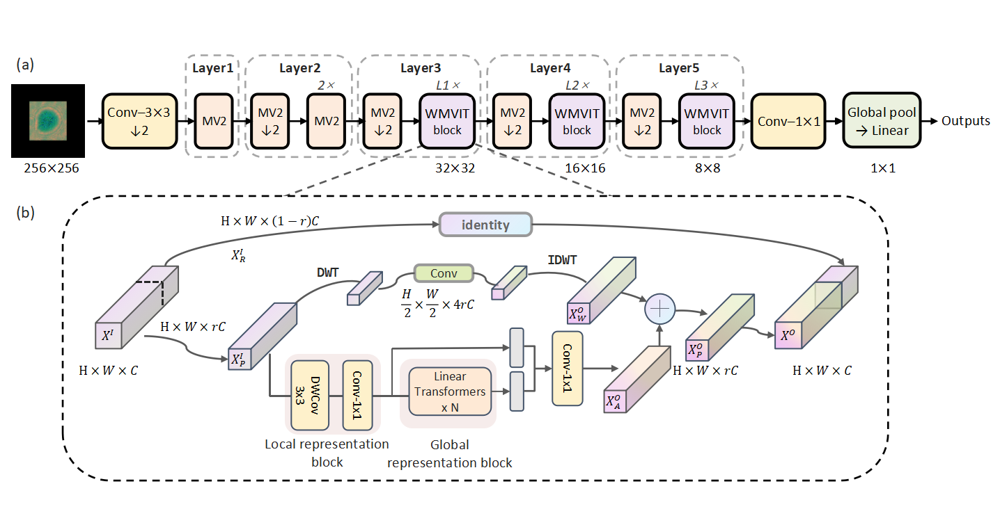

# WMViT3 🔬
[](https://pytorch.org/)
[](https://opensource.org/licenses/MIT)
[](https://www.python.org/downloads/)


> 🔔 **Note**: This is the official implementation of the paper "Computational Polarimetric Holography for Efficient Microplastic Classification via a Lightweight Wavelet-Enhanced Vision Transformer".

<div align="center">
    
</div>

## 📝 Introduction

WMViT3 is a novel lightweight Vision Transformer designed for computational polarimetric holography, enabling efficient and accurate classification of microplastics. Its core features include:

-   🏆 **High Performance**: Surpasses various mainstream lightweight models across classification accuracy on custom HPM-500 dataset.
-   ⚡ **Ultra-Lightweight**: Only **2.8M** parameters and **1.04G** FLOPs
-   💡 **Innovative Design**: Integrates **Wavelet Transform** module to enhance the model's perception of high-frequency physical features.
-   无需复杂预处理

## 🛠️ Installation

```bash
git clone https://github.com/Gmiaojy/WMViT3.git
cd WMViT3
pip install -r requirements.txt
```

## 📥 Pre-trained Model & Dataset
-   **Pre-trained Model Download**:
    We provide the model weights pre-trained on the HPM-500 dataset for rapid validation and testing.
    ```
    https://pan.baidu.com/s/1qXeXNllN6QL7QRu5_2YeNQ?pwd=resu
    ```
-   **HPM-500 Dataset**:
    The HPM-500 dataset used in this study contains 4,429 processed polarimetric holographic images across five common types of microplastics.
    ```
    https://pan.baidu.com/s/15yPLk2tmB3wMKBb7_cOHoA?pwd=resu
    ```
-   **Model Compare Results**:
    ```
    https://pan.baidu.com/s/1r_fv_YZc8XXWGqHnAguyYg?pwd=resu
    ```
    
## 🚀 Quick Start

### Inference
Use the following command to classify your images:
```bash
python test.py --model_path /path/to/your/model.pth --image_dir /path/to/your/images --gpu_id 0
```
**Note**: The `image_dir` should contain the image files you wish to classify. The script will output the classification results to the console.

### Training
To train the model from scratch, please follow these steps:
1.  Download and unzip the HPM-500 dataset.
2.  Run the data preprocessing script to perform segmentation and feature extraction on the raw holograms (as described in Section 2.2 of our paper).
    ```bash
    python tools/prepare_hpm500.py --raw_data_root /path/to/dataset --output_dir /path/to/processed_data
    ```
3.  Start the training process:
    ```bash
    python train.py --data_path /path/to/processed_data --batch_size 64 --epochs 200
    ```

## 📊 Results

### Visual Analysis
Grad-CAM visualizations demonstrate that WMViT3 (bottom row) accurately focuses on key physical features like particle edges and interference fringes. In contrast, the baseline model's attention (top row) is more diffuse and less precise.

<div align="center">
    
</div>

## 📚 Citation
If you use our code or find our work useful in your research, please cite our paper:

```bibtex
@article{guo2025computational,
  title={Computational Polarimetric Holography for Efficient Microplastic Classification via a Lightweight Wavelet-Enhanced Vision Transformer},
  author={Guo, Miao and Lin, Zijian and Guo, Buyu and Huang, Hui},
  journal={Optica Publishing Group},
  year={2025},
  publisher={Optica}
}
```

## 📄 License

This project is licensed under the MIT License. See the [LICENSE](LICENSE) file for details.

## 🤝 Contributing

Contributions are welcome! If you have any questions or suggestions, please feel free to open an issue or submit a pull request.
```
