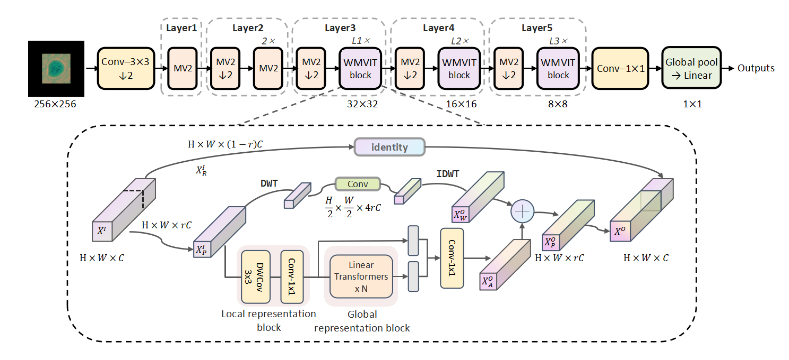

# WMViT3 🔬
[](https://pytorch.org/)
[](https://opensource.org/licenses/MIT)
[](https://www.python.org/downloads/)


> 🔔 **Note**: This is the official implementation of the paper "Computational Polarimetric Holography for Efficient Microplastic Classification via a Lightweight Wavelet-Enhanced Vision Transformer".

<div align="center">
    
</div>

## 📝 Introduction

WMViT3 is a novel lightweight Vision Transformer designed for computational polarimetric holography, enabling efficient and accurate classification of microplastics. Its core features include:

-   🏆 **High Performance**: Surpasses various mainstream lightweight models across classification accuracy on custom HPM-500 dataset.
-   ⚡ **Ultra-Lightweight**: Only **2.8M** parameters and **1.04G** FLOPs
-   💡 **Innovative Design**: Integrates **Wavelet Transform** module to enhance the model's perception of high-frequency physical features.
-   无需复杂预处理

## 🛠️ Installation

```bash
git clone https://github.com/Gmiaojy/WMViT3.git
cd WMViT3
pip install -r requirements.txt
```

## 📥 Dataset & Pre-trained models
-   **HPM-500 Dataset**:
    The HPM-500 dataset contains 4,429 processed polarimetric holographic images across five common types of microplastics(ABS,PA6,PE,PP,PS).
    ```
    https://pan.baidu.com/s/15yPLk2tmB3wMKBb7_cOHoA?pwd=resu
    ```
-   **Pre-trained Models**:
    The model weights pre-trained on the HPM-500 dataset are provided for rapid validation and testing.
    ```
    https://pan.baidu.com/s/1qXeXNllN6QL7QRu5_2YeNQ?pwd=resu
    ```
-   **Demo Dataset**:
    This project includes a small demo dataset in the `wmvit3/datas/input_example`, which all are ABS. You can use it to quickly test the model's inference and visualization capabilities without downloading the full dataset.
<!-- -   **Model Compare Results**:
    ```
    https://pan.baidu.com/s/1r_fv_YZc8XXWGqHnAguyYg?pwd=resu
    ``` -->
    
## 🚀 Quick Start

### 1. Quick Demo
before running, download the pre-trained weights. put them in the `outputs/weights/`
To help you get started quickly, we offer a demonstration script, `test_example.py`, which runs on `wmvit3/datas/input_example`. After running the script, you will find the following outputs in each model's result folder:
- prediction.csv: A file containing the predicted class for each sample.
- grad-cam images: Visualization maps highlighting the areas the model focused on for its prediction.
```bash
python test_example.py
```
### 2. Full Evaluation
`test.py` is the official script for evaluating the model's performance on the complete test set.

**Note:** Before running, please ensure you have downloaded the `HPM-500` dataset.** and put them in the `datas/After`

The script will calculate each model inference's **Accuracy, Precision, Recall, F1-Score**, and **average inference time**.
```bash
python utils/preprocess_img.py --src_path wmvit3/datas/After --det_path wmvit3/datas/Input
python test.py
```
### 3. Training
    ```bash
    python train.py --data_dir wmvit/datas/Input --batch_size 64 --epochs 200
    ```

## 📊 Results

### Visual Analysis
Grad-CAM visualizations demonstrate that WMViT3 (bottom row) accurately focuses on key physical features like particle edges and interference fringes. In contrast, the baseline model's attention (top row) is more diffuse and less precise.

<div align="center">
    
</div>

### Quantitative Results
<table>
    <thead>
        <tr>
            <th align="left">Method</th>
            <th align="center">top1↑</th>
            <th align="center">P↑</th>
            <th align="center">R↑</th>
            <th align="center">F1↑</th>
            <th align="center">Params(M)↓</th>
            <th align="center">Flops(G)↓</th>
            <th align="center">Inference Time (ms/sample)↓</th>
        </tr>
    </thead>
    <tbody>
        <tr>
            <td colspan="8" align="center"><strong>CNN-based Methods</strong></td>
        </tr>
        <tr>
            <td align="left">EdgeNeXt-XXS</td>
            <td align="center">74.72</td>
            <td align="center">0.7067</td>
            <td align="center">0.7174</td>
            <td align="center">0.7093</td>
            <td align="center">1.16</td>
            <td align="center">0.26</td>
            <td align="center">10.8753</td>
        </tr>
        <tr>
            <td align="left">ShuffleNetV2 (1.0x)</td>
            <td align="center">95.03</td>
            <td align="center">0.9483</td>
            <td align="center">0.9452</td>
            <td align="center">0.9466</td>
            <td align="center">1.26</td>
            <td align="center">0.20</td>
            <td align="center">6.0673</td>
        </tr>
        <tr>
            <td align="left">FasterNet-T0</td>
            <td align="center">76.30</td>
            <td align="center">0.7252</td>
            <td align="center">0.7325</td>
            <td align="center">0.7265</td>
            <td align="center">2.63</td>
            <td align="center">0.45</td>
            <td align="center">3.3741</td>
        </tr>
        <tr>
            <td align="left">InceptionNeXt-T</td>
            <td align="center">87.81</td>
            <td align="center">0.8767</td>
            <td align="center">0.8676</td>
            <td align="center">0.8666</td>
            <td align="center">25.76</td>
            <td align="center">5.49</td>
            <td align="center">4.6799</td>
        </tr>
        <tr>
            <td align="left">MobileNetV2 (1.0x)</td>
            <td align="center">93.23</td>
            <td align="center">0.9229</td>
            <td align="center">0.9189</td>
            <td align="center">0.9202</td>
            <td align="center">2.23</td>
            <td align="center">0.44</td>
            <td align="center">5.5528</td>
        </tr>
        <tr>
            <td align="left">MobileNetV3-Large (1.0x)</td>
            <td align="center">94.13</td>
            <td align="center">0.9340</td>
            <td align="center">0.9323</td>
            <td align="center">0.9328</td>
            <td align="center">4.21</td>
            <td align="center">0.31</td>
            <td align="center">6.2352</td>
        </tr>
        <tr>
            <td colspan="8" align="center"><strong>Transformer-based & Hybrid Methods</strong></td>
        </tr>
        <tr>
            <td align="left">EfficientViT-B0</td>
            <td align="center">88.71</td>
            <td align="center">0.8609</td>
            <td align="center">0.8773</td>
            <td align="center">0.8668</td>
            <td align="center">2.14</td>
            <td align="center">0.14</td>
            <td align="center">8.8733</td>
        </tr>
        <tr>
            <td align="left">PoolFormer-S12</td>
            <td align="center">39.73</td>
            <td align="center">0.2361</td>
            <td align="center">0.285</td>
            <td align="center">0.2442</td>
            <td align="center">11.40</td>
            <td align="center">2.39</td>
            <td align="center">4.8865</td>
        </tr>
        <tr>
            <td align="left">PVT v2-B0</td>
            <td align="center">35.21</td>
            <td align="center">0.2669</td>
            <td align="center">0.2683</td>
            <td align="center">0.2495</td>
            <td align="center">3.41</td>
            <td align="center">0.70</td>
            <td align="center">11.5653</td>
        </tr>
        <tr>
            <td align="left">MobileViT-S</td>
            <td align="center">88.71</td>
            <td align="center">0.8770</td>
            <td align="center">0.8598</td>
            <td align="center">0.8674</td>
            <td align="center">5.00</td>
            <td align="center">1.84</td>
            <td align="center">12.2498</td>
        </tr>
        <tr>
            <td align="left">MobileViTv2-S</td>
            <td align="center">91.42</td>
            <td align="center">0.8989</td>
            <td align="center">0.9059</td>
            <td align="center">0.9005</td>
            <td align="center">4.39</td>
            <td align="center">1.88</td>
            <td align="center">10.7696</td>
        </tr>
        <tr>
            <td align="left">MobileViTv3-S</td>
            <td align="center">96.61</td>
            <td align="center">0.9595</td>
            <td align="center">0.9550</td>
            <td align="center">0.9566</td>
            <td align="center">13.75</td>
            <td align="center">3.90</td>
            <td align="center">8.3829</td>
        </tr>
        <tr>
            <td align="left">MobileViTv3-XS</td>
            <td align="center">95.26</td>
            <td align="center">0.9422</td>
            <td align="center">0.9503</td>
            <td align="center">0.9461</td>
            <td align="center">7.75</td>
            <td align="center">2.22</td>
            <td align="center">9.9512</td>
        </tr>
        <tr>
            <td align="left"><strong>MWViT3 (Ours)</strong></td>
            <td align="center"><strong>97.97</strong></td>
            <td align="center"><strong>0.9786</strong></td>
            <td align="center"><strong>0.9726</strong></td>
            <td align="center"><strong>0.9754</strong></td>
            <td align="center"><strong>2.80</strong></td>
            <td align="center"><strong>1.04</strong></td>
            <td align="center"><strong>8.4058</strong></td>
        </tr>
    </tbody>
</table>


## 📚 Citation
If you use our code or find our work useful in your research, please cite our paper:

```bibtex
@article{guo2025computational,
  title={Computational Polarimetric Holography for Efficient Microplastic Classification via a Lightweight Wavelet-Enhanced Vision Transformer},
  author={Guo, Miao and Lin, Zijian and Guo, Buyu and Huang, Hui},
  journal={Optica Publishing Group},
  year={2025},
  publisher={Optica}
}
```

## 📄 License

This project is licensed under the MIT License. See the [LICENSE](LICENSE) file for details.

## 🤝 Contributing

Contributions are welcome! If you have any questions or suggestions, please feel free to open an issue or submit a pull request.
```
